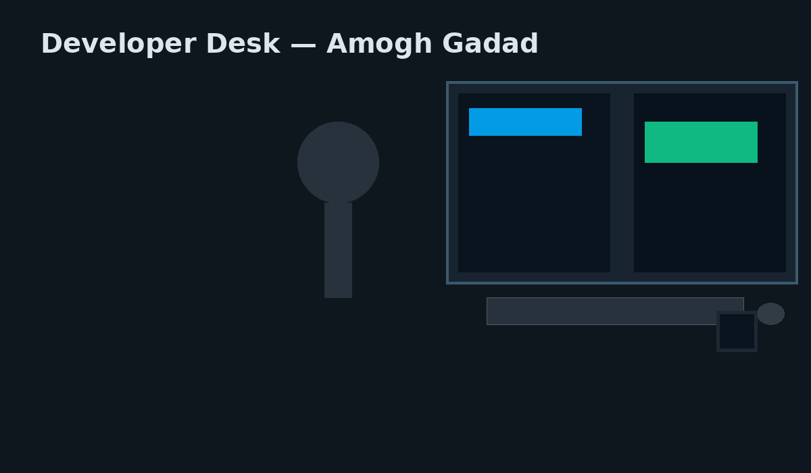

<!-- Put this file in a repo named exactly your GitHub username (amogh-gadad) -->
<!-- Images/icons referenced here should be stored in ./assets/ (python.svg, c.svg, cpp.svg, js.svg, opencv.svg, raspberrypi.svg, tensorflow.svg, yolo.svg, sqlite.svg, git.svg, vscode.svg, hero-devdesk.png) -->

  <h1 style="margin-bottom:0.1rem">Hey there 👋, I'm Amogh Gadad</h1>
  
Embedded & Automotive Software Engineer | Cybersecurity | Robotics & Edge AI

<table width="100%">
  <tr>
    <!-- LEFT COLUMN: Intro + bullets -->
    <td width="60%" valign="top" style="padding-right:20px">
      <h3>Robotics | Embedded Systems | Automotive</h3>

      <ul>
        <li>🚀 I build Raspberry Pi–based autonomous systems (lane + object detection, ultrasonic obstacle avoidance).</li>
        <li>🔐 Working on Automotive Cybersecurity & secure comms for vehicle networks.</li>
        <li>🤖 Developing a Real-Time Deepfake Voice & Face Cloner (research + robotics integration).</li>
        <li>📂 All projects → <a href="https://github.com/amogh-gadad?tab=repositories">My GitHub Repos</a></li>
        <li>✉️ Reach me: <a href="https://www.linkedin.com/in/amogh-gadad">LinkedIn</a></li>
        <li>☕ Fun fact: I turn coffee into clean, modular code.</li>
      </ul>

      

      <h4>🔧 Languages & Tools</h4>

      <!-- Store these icon PNGs/SVGs in /assets or /images folder of this repo and reference them relatively -->
      

        &nbsp;
        &nbsp;
        &nbsp;
        &nbsp;
        &nbsp;
        &nbsp;
        &nbsp;
        &nbsp;
        &nbsp;
        &nbsp;
        
      

      

        Embedded C
        Python
        YOLO / OpenCV
        Linux
      

      

      <h4>🧰 Projects (pin these on your profile)</h4>
      <ol>
        <li><strong>Self-Driving Car (Raspberry Pi)</strong> — Lane detection + YOLO object detection + ultrasonic avoidance.</li>
        <li><strong>Automotive Cybersecurity</strong> — Securing CAN/Socket comms and threat modelling.</li>
        <li><strong>Real-Time Deepfake Cloner</strong> — Voice + face cloning with robotics demo.</li>
      </ol>

      

      
Tip: Pin the repos above using <em>Customize your pins</em> on your GitHub profile so they show in the pinned section.

    </td>

    <!-- RIGHT COLUMN: Hero image -->
    <td width="40%" valign="top" style="text-align:center; padding-left:20px">
      
    </td>
  </tr>
</table>

  

    
    &nbsp;
    
  

  <!-- Social buttons -->
  
  &nbsp;
  

  Built with ❤️ — open to collaborate on Embedded Linux, Edge AI & Automotive projects.

